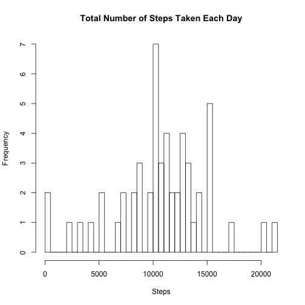
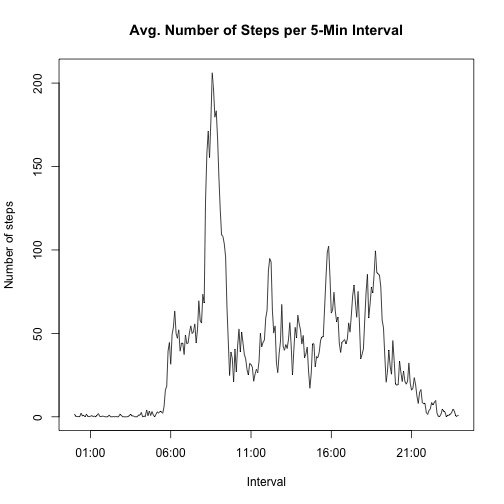
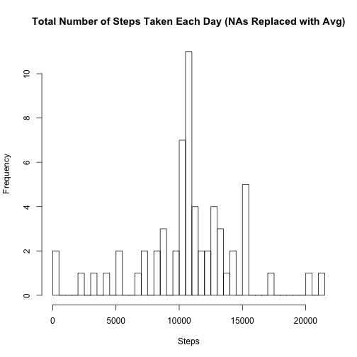
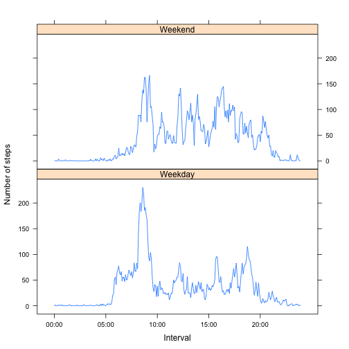

##Loading and preprocessing the data.

```r
data <- read.csv("/Users/dmoney/Desktop/R/activity.csv", header = T)
```
Load the packages I will use.

```r
library(dplyr)
library(lattice)
```

Add a new variable called posix to the data set.
This new column matches the interval column but reformats the data into POSIXct.
The new "posix" variable will come in handy later on when I plot the data.

```r
hours <- NULL
for(i in 1:24){
        h1 <- 0:23
        h2 <- rep(h1[i], times = 12)
        hours <- c(hours, h2)
}
minutes <- c(0, 5, 10, 15, 20, 25, 30, 35, 40, 45, 50, 55)
posix <- paste(hours, minutes, sep = ":")
posix <- strptime(posix, format = "%H:%M")
posix <- as.POSIXct(posix)
data <- cbind(data, posix = posix)
```

##What is mean total number of steps taken per day?
Reshape the data to find the total number of steps taken per day.
I then use this data to create histogram of "Total Number of Steps Taken Each Day".

```r
totalsteps <- aggregate(steps ~ date, data = data, sum) %>%
        rename(total_daily_steps = steps)
hist(totalsteps$total_daily_steps, 
     xlab = "Steps", 
     main = "Total Number of Steps Taken Each Day",
     breaks = 40)
```

 
Calculate the mean and median of the total number of steps taken each day.

```r
mean(totalsteps$total_daily_steps)
```

```
## [1] 10766.19
```

```r
median(totalsteps$total_daily_steps)
```

```
## [1] 10765
```

##What is the average daily activity pattern?
Reshape data to calculate the number of Steps Per 5-minute Interval.
I refer to this reshaped data set as SPI.  I can now create a time series plot using this data of the 5-minute interval and avg steps taken across all days.  I use the posix variable that I created earlier as the x-axis on the plot.

```r
SPI <- aggregate(steps ~ interval, data = data, mean) %>%
        rename(avg_steps = steps) %>%
                cbind(posix) %>%
                        select(avg_steps, interval, posix)
plot(SPI$posix, SPI$avg_steps, 
     type = "l",
     xlab = "Interval",
     ylab = "Number of steps",
     main = "Avg. Number of Steps per 5-Min Interval")
```

 

Determine which 5-minute interval contains the maximum number of steps?

```r
filter(SPI, avg_steps == max(avg_steps))[[1, 2]]
```

```
## [1] 835
```

##Imputing missing values.
Calculate and report the total number of missing values in the dataset.

```r
sum(is.na(data))
```

```
## [1] 2304
```
Fill in missing values using the avg from the 5-minute interval from the SPI data frame and create a new dataset that is equal to the original dataset but with the missing data filled in.

```r
newdata <- data
for(i in 1:17568){
        newdata$steps[i] <- if(is.na(data$steps[i]) == TRUE){
                subset(SPI, SPI$interval == data$interval[i])[[1]]                                  
                }else{data$steps[i]}
}
```
Reshape the new data.  Use my new dataset to make a histogram of the total number of steps taken each day.

```r
newtotalsteps <- aggregate(steps ~ date, data = newdata, sum) %>%
        rename(total_daily_steps = steps)
hist(newtotalsteps$total_daily_steps,
     xlab = "Steps", 
     main = "Total Number of Steps Taken Each Day (NAs Replaced with Avg)",
     breaks = 40)
```

 
Calculate and report the mean and median total number of steps taken per day.

```r
mean(newtotalsteps$total_daily_steps)
```

```
## [1] 10766.19
```

```r
median(newtotalsteps$total_daily_steps)
```

```
## [1] 10766.19
```
These values are very close to the estimates from the first part of the assignment, in fact the mean is nearly identical, and the median only slightly increased.  The impact of imputing missing data will slightly alter the overall data, but for the most part in does not change.

##Are there differences in activity patterns between weekdays and weekends?
Create a new factor variable with two levels – "Weekday" and "Weekend".
In order to do that I must create a function that defines each day of the week as a "Weekday" or "Weekend".  I then add this variable to my new dataset (data set with the NAs removed) to identify each row as a weekday or weekend.

```r
day_type_FUN <- function(x){
       ifelse(x %in% c("Monday", "Tuesday", "Wednesday", "Thursday", "Friday"),
                "Weekday", ifelse(x %in% c("Saturday", "Sunday"), 
                        "Weekend", "not_valid_day"))
}
day_of_week <- as.POSIXlt(newdata$date)
day_of_week <- weekdays(day_of_week)
newdata <- cbind(newdata, day_of_week)
day_type <- day_type_FUN(day_of_week)
newdata <- cbind(newdata, day_type)
newdata$day_type <- factor(newdata$day_type)
```
Calculate the number of Steps Per Interval but separate into two groups - Weekday and Weekend.  I can use this data to create a time series panel plot of the 5-minute interval and avg steps for both weekdays and weekends.

```r
#reshape data for plotting
newdata_weekday <- filter(newdata, day_type == "Weekday")
newdata_weekend <- filter(newdata, day_type == "Weekend")
newSPI_weekday <- aggregate(steps ~ interval, data = newdata_weekday, mean) %>%
        mutate(day_type = "Weekday")
newSPI_weekend <- aggregate(steps ~ interval, data = newdata_weekend, mean) %>%
        mutate(day_type = "Weekend")
newSPI <- rbind(newSPI_weekday, newSPI_weekend)
newSPI$day_type <- factor(newSPI$day_type)
newSPI <- cbind(newSPI, posix = posix)

#create plotting margins and label
at <- c(newSPI$posix[1],
        newSPI$posix[61],
        newSPI$posix[121],
        newSPI$posix[181],
        newSPI$posix[241])
labels <- c("00:00", "05:00", "10:00", "15:00", "20:00")

#plot the data
final_plot <- xyplot(steps ~ posix | day_type, data = newSPI,
       type = "l",
       xlab = "Interval",
       ylab = "Number of steps",
       layout = c(1, 2),
       scales = list(x=list(at = at, labels = labels)))
final_plot
```

 
